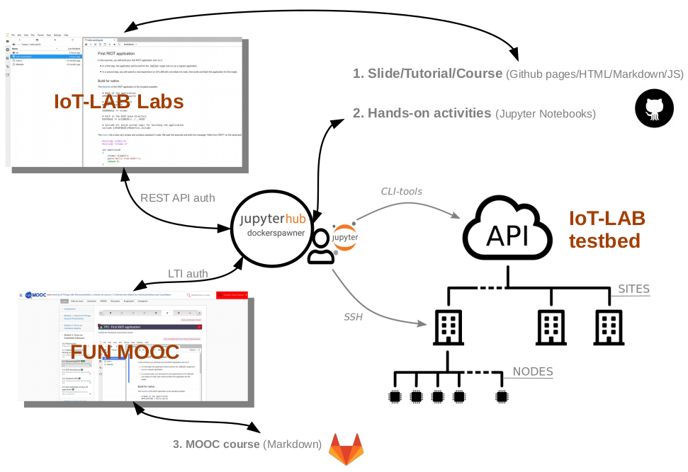

class: center, middle

# IoT-LAB testbed and Computer science education

## Saint-Marcel Frederic / SED team

.center[
    
]

---

## Context

- an experimental platform is more than just a research tool

- general public education **+** academic research **=** large scale testbed **≃** 800 IoT-LAB M3 nodes

- a strong experience in [IoT courses](https://www.iot-lab.info/community/education/) (> 30 courses)

- synergy of two projects: [RIOT OS](https://www.riot-os.org/) and FIT IoT-LAB testbed

- COVID19 ➔ increased need for online courses

- two current courses on the IoT-LAB testbed

.center[
    
]

.center[
| Course | Duration | &nbsp;&nbsp;Participants |
|:------:|---------:|-------------------------:|
| [IoT MOOC (2nd session)](https://www.fun-mooc.fr/courses/course-v1:inria+41020+session02/about) | 2 months | > 2000 |
| [EWSN2021 IoT tutorial](https://ewsn2021.ewi.tudelft.nl/workshops-and-tutorials) (*) | 3 hours | ≈ 30 |
]

(*) Virtual conference with Zoom and Slack

---

## Timeline

* **December 2018**: IoT MOOC project submission
* **February 2019**: Kick-off meeting with FUN team
* **February 2019 ➔ February 2020** (*):
  * course content creation (i.e. Markdown)
  * videos shooting
  * hands-on activities (Jupyter notebooks inspired by Python MOOC ➔ JupyterLAB IDE) 
  * testbed features: monkey testing, users management, scheduler admission rules, radio communication   
* **April ➔ June 2020**: 1st MOOC session (> 6000 participants)
* **April 2020**: IoT-LAB JupyterHub hosting
  * managed by INRIA DSI for the 1st MOOC session
  * creation of [IoT-LAB Labs](https://labs.iot-lab.info)
  * add MOOC LoRaWAN notebooks
* **September 2020**: [RIOT Summit](https://summit.riot-os.org/2020/) & [RIOT Summit tutorial: Iot security](https://riot-os.github.io/riot-course/slides/tutorial-summit-security/#1)
* **October 2020**: add MOOC LoRaWAN module 
* **February 2021**: start of 2nd Mooc session and EWSN tutorial
  * EWSN tutorial support = HTML/Markdown slides with automatic launch of IoT-LAB Labs notebooks (inspired by [RIOT courses](https://github.com/RIOT-OS/riot-course))

(*) we are proud to be the first MOOC to offer pedagogical activities on real hardware.
---

## Architecture

.center[
    
]

1. [iotlab-courses repository](https://github.com/fsaintma/iotlab-courses)
2. [iot-lab-training repository](https://github.com/iot-lab/iot-lab-training)
3. [mooc-iot-ressources repository](https://gitlab.inria.fr/learninglab/mooc-iot/mooc-iot-ressources)

---

## Demo

.center[
Available at **https://labs.iot-lab.info**

**Short demo: discover RIOT HelloWorld notebook!**
<form class=notebook>
    <input class=login id="login_hello" type="text" oninput="check_login('login_hello', 'launcher_hello')" placeholder="Enter your IoT-LAB login">
    <input class=launcher id="launcher_hello" type="button" value="Launch notebook" onclick="open_notebook('login_hello', 'riot/basics/hello-world/hello-world.ipynb')" disabled>
</form>
]

---

## Future work

- 3rd Mooc session (BLE mesh, Ultra Wideband)
- Add Zephyr OS support (RIOT OS and Contiki-NG already supported)
  - Write Zephyr OS port for IoT-LAB M3/A8-M3 nodes
- Embedded Linux conference submission (i.e. Linux fondation)
- New notebooks:
  - Embedded Linux nodes (Yocto Linux images)
  - IA (Jetson Nano), Deep Learning (Gapuino) nodes
  - Edge computing
  - SDR (Software Define Radio)

.center[
    
]

[INRIA Academy](https://www.inria.fr/en/inria-academy): a continuing education program dedicated to open source software (RIOT OS formations) 
[FUN Campus](https://www.fun-campus.fr/fr/a-propos-de-fun-campus/): FUN catalogue available for teachers (IoT MOOC is added in it)

---

